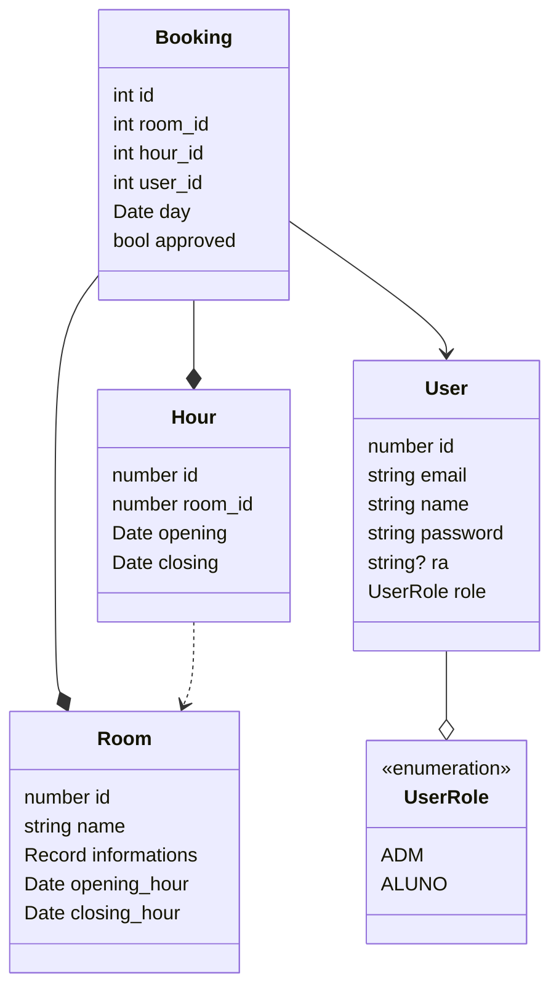

```mermaid
classDiagram
    class User {
        number id
        string email
        string name
        string password
        string? ra
        UserRole role
    }

    class Room {
        number id
        string name
        Record informations
        Date opening_hour
        Date closing_hour
    }

    class Hour {
        number id
        number room_id
        Date opening
        Date closing
    }

    class Booking {
        int id
        int room_id
        int hour_id
        int user_id
        Date day
        bool approved
    }

    class UserRole {
        <<enumeration>>
        ADM
        ALUNO
    }

    Booking --* Room
    Booking --* Hour
    Booking --> User

    Hour ..> Room

    User --o UserRole
```