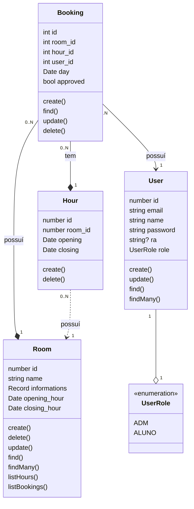

```mermaid
classDiagram
    class User {
        number id
        string email
        string name
        string password
        string? ra
        UserRole role

        create()
        update()
        find()
        findMany()
    }

    class Room {
        number id
        string name
        Record informations
        Date opening_hour
        Date closing_hour

        create()
        delete()
        update()
        find()
        findMany()
        listHours()
        listBookings()
    }

    class Hour {
        number id
        number room_id
        Date opening
        Date closing

        create()
        delete()
    }

    class Booking {
        int id
        int room_id
        int hour_id
        int user_id
        Date day
        bool approved

        create()
        find()
        update()
        delete()
    }

    class UserRole {
        <<enumeration>>
        ADM
        ALUNO
    }

    Booking "0..N" --* "1" Room : possuí
    Booking "0..N" --* "1" Hour : tem
    Booking "0..N" --> "1" User : possuí

    Hour "0..N" ..> "1" Room : possuí

    User "1" --o "1" UserRole
```