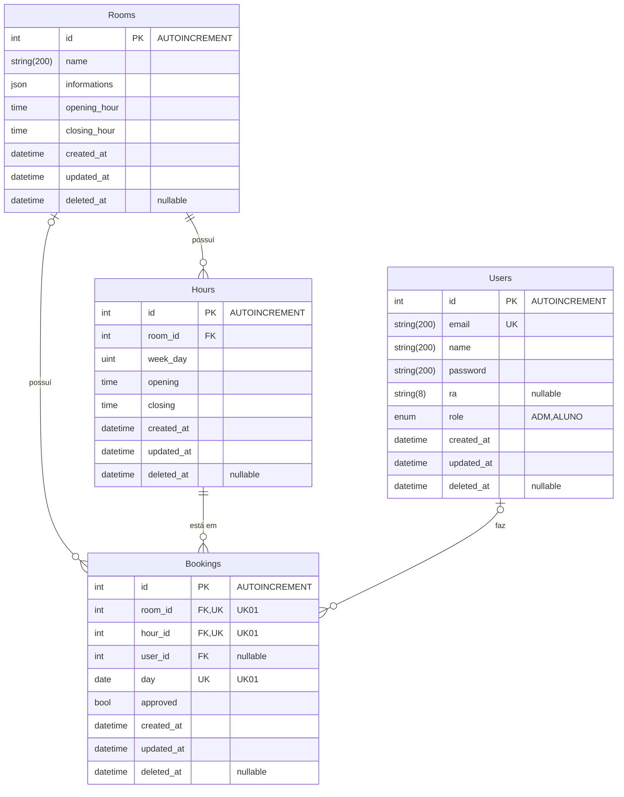

```mermaid
erDiagram
    Users {
        int id PK "AUTOINCREMENT"
        string(200) email UK
        string(200) name
        string(200) password
        string(8) ra "nullable"
        enum role "ADM,ALUNO"
        datetime created_at
        datetime updated_at
        datetime deleted_at "nullable"
    }

    Rooms {
        int id PK "AUTOINCREMENT"
        string(200) name
        json informations
        time opening_hour
        time closing_hour
        datetime created_at
        datetime updated_at
        datetime deleted_at "nullable"
    }

    Hours {
        int id PK "AUTOINCREMENT"
        int room_id FK
        uint week_day
        time opening
        time closing
        datetime created_at
        datetime updated_at
        datetime deleted_at "nullable"
    }
    
    Bookings {
        int id PK "AUTOINCREMENT"
        int room_id FK,UK "UK01"
        int hour_id FK,UK "UK01"
        int user_id FK "nullable"
        date day UK "UK01"
        bool approved
        datetime created_at
        datetime updated_at
        datetime deleted_at "nullable"
    }

    Rooms ||--o{ Hours : "possuí"
    Rooms |o--o{ Bookings : "possuí"
    Hours ||--o{ Bookings : "está em"
    Users |o--o{ Bookings : "faz"

```